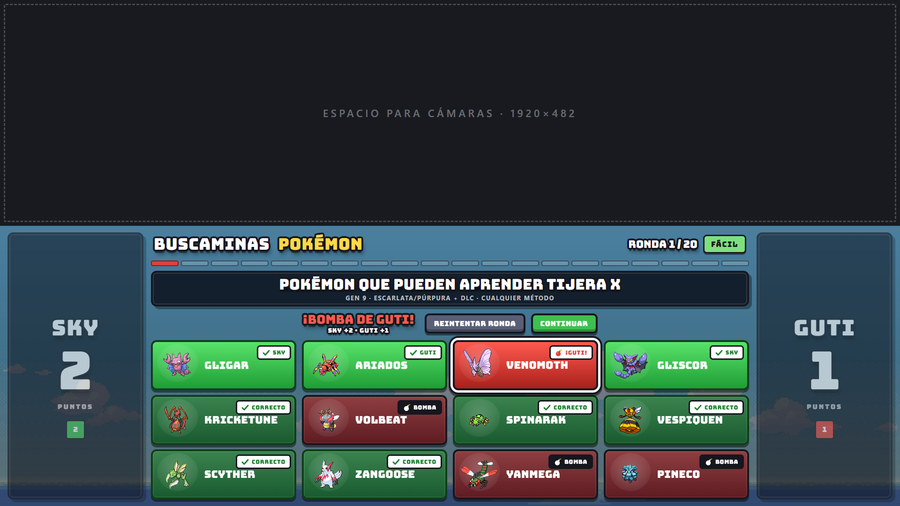
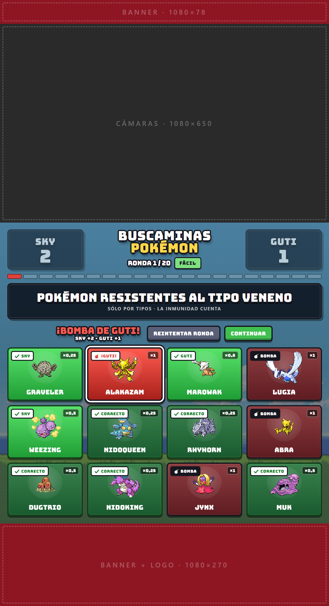

# Buscaminas Pokémon

Juego para grabar/streamear entre dos personas, construido sobre la infraestructura visual de
[PokeDuelo](https://github.com/terremotoparatodos/pokeduelo) (mismas zonas de cámara, jugadores, tipografías,
fondo, panel de control y teclas).

**Jugar:** [vertical](https://titanterremoto.github.io/buscaminas-pokemon/) ·
[horizontal](https://titanterremoto.github.io/buscaminas-pokemon/horizontal.html)

| Horizontal 1920×1080 | Vertical 1080×1982 |
|---|---|
|  |  |

En cada ronda aparece una condición ("Pokémon resistentes al tipo Fuego") y 12 Pokémon: **8 la cumplen y 4 son bombas**.

**Modo por defecto: un clic cada uno** (`turnMode: 'click'`). SKY y GUTI juegan el mismo tablero alternándose:
cada acierto suma 1 punto a quien hizo clic y el turno pasa al otro. Quien toca una bomba termina la ronda (se
revela todo y la carta muestra quién la pisó). Si aparecen los 8 sin bombas: ¡TABLERO LIMPIO!
Quién abre la ronda se alterna ronda a ronda. Con `turnMode: 'round'` vuelve el modo de una ronda entera cada uno.

## Abrir

| Versión | Local (`npm run serve`) | GitHub Pages |
|---|---|---|
| Vertical 1080×1982 | http://localhost:8123/ | https://titanterremoto.github.io/buscaminas-pokemon/ |
| Horizontal 1920×1080 | http://localhost:8123/horizontal.html | https://titanterremoto.github.io/buscaminas-pokemon/horizontal.html |

También funciona con doble clic sobre `index.html` / `horizontal.html` (no necesita servidor ni Internet:
datos, sprites, fuentes y fondo están en el proyecto).

Parámetros de URL:

- `?seed=12345` partida reproducible (mismo orden de rondas y mismas posiciones de cartas)
- `?debug=1` panel de debug (id de ronda, condición, correctos/bombas, multiplicadores, fuentes A/B)
- `?nopanel=1` arranca sin panel · `?clean=1` sin guías de zonas · `#panel` sólo el panel (para otra pestaña)

## Layouts

Igual que PokeDuelo, cada orientación tiene su diseño propio (`css/vertical.css`, `css/horizontal.css`) y comparten
motor, lógica, banco de rondas y puntuación (`js/*`). Las zonas virtuales son idénticas a PokeDuelo:

- **Vertical** (`index.html`): banner 1080×78 · **cámaras 1080×650** · juego 1080×984 · banner+logo 1080×270.
  Marcadores de SKY/GUTI arriba a izquierda/derecha (bajo su cámara), cartas verticales 4×3.
- **Horizontal** (`horizontal.html`): **cámaras 1920×482** · juego 1920×598. Marcadores en columnas laterales,
  tablero al centro, cartas apaisadas 4×3.

El tablero nunca sale de la zona de juego (verificado automáticamente en QA) y no hay scroll durante la partida.

## Teclas (grabación)

| Tecla | Acción |
|---|---|
| `Enter` / `Espacio` | Continuar (con la ronda terminada) · nueva partida al final |
| `T` | Reintentar ronda (si `allowRetry`) |
| `J` | Cambiar turno (modo ronda: los puntos de la ronda en curso pasan al otro) |
| `U` / `Retroceso` | Deshacer el último clic (devuelve punto y turno; reabre la ronda si fue una bomba) |
| `←` / `→` | Ronda anterior (deshace su resultado) / siguiente (salta) |
| `+` / `−` | Sumar / restar 1 punto al jugador activo |
| `M` | Mute |
| `D` | Mostrar/ocultar debug en el panel |
| `R` | Modo grabación 1:1 (como PokeDuelo) |
| `G` | Ocultar guías de zonas virtuales |
| `P` | Mostrar/ocultar panel de control |

El panel (botón *↗ Pestaña*) se puede abrir en otra pestaña: se sincroniza con la pantalla grabada
(localStorage + BroadcastChannel, igual que PokeDuelo).

## Configuración (`js/config.js`)

`players` (SKY, GUTI), `startingPlayer`, `totalRounds` (20), `turnMode` (`click` | `round`), `allowRetry` (true),
`perfectBonus` (0; en modo clic es para quien encuentra el último), `bombPenalty` (0, lo pierde quien toca la bomba),
`keepPointsOnBomb` (true), `difficultyCurve` (fácil → normal → difícil; en modo ronda va por pares para que A y B
jueguen la misma dificultad), rutas de `audio`.

Audio: `assets/audio/{correct,bomb,perfect,next-round}.mp3`. Si no existen, no suena nada.

## Datos: cómo se garantiza que no haya respuestas incorrectas

**Ninguna respuesta está escrita a mano.** `data/rounds.json` sólo dice qué 12 Pokémon aparecen y cuál es la condición;
el motor (`js/engine.js › evaluateCondition`) calcula qué es correcto y qué es bomba desde `data/pokemon-facts.json`.

Dos fuentes independientes, descargadas antes (nunca durante una partida):

- **Fuente A · PokéAPI** (REST v2).
- **Fuente B · Pokémon Showdown**, archivos `data/*.ts` del repo `smogon/pokemon-showdown` **fijados a un commit**
  (queda registrado en `data/verification.json`).

Reglas (ruleset `gen9`):

- **Habilidad**: habilidades actuales; `abilityMode: any` (normal u oculta) por defecto; `normal`/`hidden` disponibles.
- **Movimiento**: *Gen 9 = Escarlata/Púrpura + DLC* (PokéAPI: `scarlet-violet`, `the-teal-mask`, `the-indigo-disk`;
  Showdown: códigos `9L/9M/9E/9T/9R/9S`). Cualquier método legal. Un **impostor** además debe cumplir: ninguna
  pre-evolución lo aprende, y **no lo aprende en otro juego de Gen 9** (Legends: Z-A, Champions; mods de Showdown y
  PokéAPI) para que nadie pueda discutir la bomba.
- **Resistencia / Debilidad**: sólo por tipos (sin habilidades, objetos, Tera, clima). Se multiplican los dos tipos.
  Resistencia `< 1` (`includeImmunity: true` cuenta ×0), debilidad `> 1`.

Formas: cada carta es `species + form + id` (id de `/pokemon` de PokéAPI). Se usan sólo formas por defecto y
regionales con nombre en español en PokéAPI. Se excluyen megas, gmax, totem, primigenias y especies con formas de
otros tipos (Rotom, Castform, Ogerpon, Necrozma, Arceus…) o cuya forma por defecto tiene nombre propio
(Toxtricity, Urshifu, Lycanroc…). El detalle está en `data/generation-report.json`.

### Pipeline

```bash
npm run fetch      # descarga/cachea las dos fuentes en .cache/ (no se versiona)
npm run build      # generate-rounds + validate-rounds
npm test           # tests automáticos
node scripts/audit-serebii.mjs   # opcional: tercera fuente (Serebii) para rondas de movimiento
```

`scripts/validate-rounds.mjs` reconstruye cada fuente por separado y evalúa **cada carta tres veces** (A, B y
pokemon-facts). Una ronda es válida sólo si: 12 Pokémon distintos · exactamente 8 correctos y 4 bombas · los 8
positivos **y** los 4 negativos coinciden en ambas fuentes · formas elegibles · condición con ruleset y campos
completos · texto de la pregunta derivado de la condición · tablas de tipos idénticas. Si algo falla imprime
`VALIDATION FAILED` con la ronda y el Pokémon y **no genera** `data/game-data.js` (lo único que carga el juego).

Archivos:

- `data/pokemon-facts.json` — hechos en los que coinciden las dos fuentes (Pokémon usados + tabla de tipos + nombres).
- `data/rounds.json` — banco de rondas (sin respuestas).
- `data/verification.json` — auditoría por carta: valor y detalle en Fuente A y B, fecha, commit, ruleset.
- `data/generation-report.json` — Pokémon excluidos, discrepancias entre fuentes, candidatos descartados.
- `data/game-data.js` — paquete del juego generado por el validador.

Para agregar una familia de condición nueva (tipo, peso, grupo huevo…): una entrada en `CONDITIONS` de
`js/engine.js`, su texto en `describeCondition`, y el dato en ambos adaptadores (`scripts/lib/sources.mjs`).

## Estructura

```
buscaminas-pokemon/
  index.html · horizontal.html
  css/ common.css · vertical.css · horizontal.css
  js/  config.js · engine.js · game.js · audio.js · app.js
  data/ (ver arriba)
  assets/ sprites/ (PokeAPI/sprites) · fonts/ (Bungee, Press Start 2P · OFL) · img/ (fondo de PokeDuelo) · audio/
  scripts/ fetch-sources · generate-rounds · validate-rounds · audit-serebii · serve · run-tests · lib/
  tests/ engine · validator · game · data
  docs/screenshots/
```

El fondo (`assets/img/nature-1768605061922-3261.jpg`) es el mismo de PokeDuelo.
